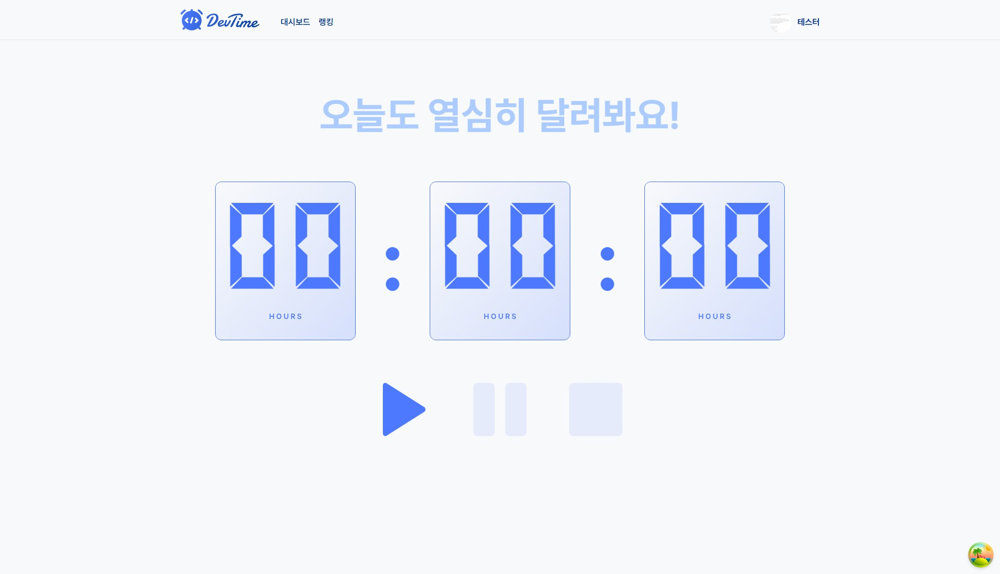
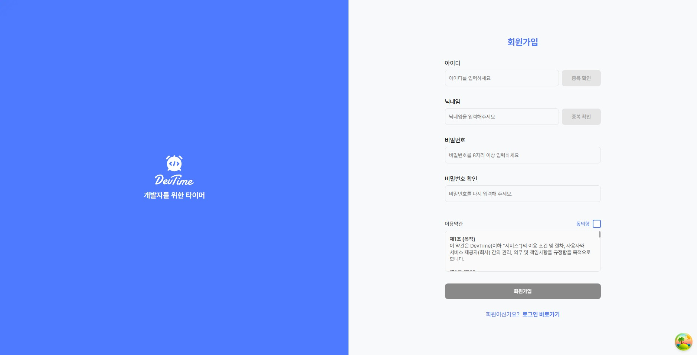

# Dev Time 2

개발 시간 기록·관리 웹 애플리케이션입니다. 타이머, 대시보드, 랭킹, 마이페이지 등 기능을 제공합니다.

## 스크린샷

**타이머 (홈)**



**회원가입**



## 기술 스택

| 구분             | 기술                                  |
| ---------------- | ------------------------------------- |
| **프레임워크**   | Next.js 14                            |
| **언어**         | TypeScript                            |
| **상태 관리**    | Zustand, TanStack React Query         |
| **폼**           | React Hook Form                       |
| **HTTP**         | Axios                                 |
| **스타일**       | CSS Modules, clsx                     |
| **테스트**       | Vitest (단위·스토리북), Cypress (E2E) |
| **문서/UI 개발** | Storybook                             |

## 프로젝트 구조

```
src/
├── app/                    # Next.js App Router 페이지
│   ├── Home/               # 홈·타이머
│   ├── dashboard/          # 대시보드 (통계, 히트맵, 기록)
│   ├── ranking/            # 랭킹
│   ├── mypage/             # 마이페이지
│   ├── profile/            # 프로필 생성
│   ├── login/              # 로그인
│   └── auth/               # 인증 콜백 등
├── components/             # 공통 컴포넌트
│   ├── atoms/              # 기본 UI (CommonInput, CommonModal 등)
│   └── modules/            # 복합 컴포넌트 (Header, TodoList, CommonTable 등)
├── config/                 # API 설정, 인증 유틸
├── constant/               # 쿼리 키, 상수
├── store/                  # Zustand 스토어 (타이머, 모달)
├── types/                  # API 타입 (OpenAPI 생성 포함)
├── utils/                  # 공통 유틸
└── provider/               # React Query 등 프로바이더
```

## 스크립트

| 명령어                    | 설명                                           |
| ------------------------- | ---------------------------------------------- |
| `npm run dev`             | 개발 서버 실행                                 |
| `npm run build`           | 프로덕션 빌드                                  |
| `npm start`               | 빌드된 앱 실행                                 |
| `npm run lint`            | ESLint 실행                                    |
| `npm run test`            | Vitest 워치 모드 (단위 + 스토리북 테스트)      |
| `npm run cypress:open`    | Cypress IDE 실행                               |
| `npm run cypress:run`     | Cypress E2E 헤드리스 실행                      |
| `npm run e2e`             | 3000 포트 정리 후 dev 서버 띄우고 Cypress 실행 |
| `npm run storybook`       | Storybook 개발 서버 (포트 6006)                |
| `npm run build-storybook` | Storybook 정적 빌드                            |
| `npm run generate:types`  | OpenAPI 스펙으로 API 타입 생성                 |

## 테스트

- **단위/컴포넌트**: Vitest + Testing Library (`src/**/*.test.{ts,tsx}`)
- **스토리북**: Vitest 브라우저 모드 + `@vitest/browser-preview` (Chromium)
- **E2E**: Cypress (`npm run e2e`)

API 타입은 `generate:types`로 백엔드 OpenAPI 문서(`https://devtime.prokit.app/docs/json`)에서 생성하며, 결과는 `src/types/api/generated.ts`에 저장됩니다.

## 코드 품질

- **Husky**로 커밋 전 훅 실행
- **lint-staged**로 스테이징된 `.js`, `.ts`, `.tsx`에 대해 ESLint + Prettier 자동 실행

---

## API 소통 방식

백엔드 OpenAPI 스펙을 기준으로 타입을 생성하고, 경로·메서드 단위로 요청/응답 타입을 추론해 사용합니다.

### 1. 타입 생성

- **명령어**: `npm run generate:types`
- **동작**: `https://devtime.prokit.app/docs/json`에서 OpenAPI JSON을 받아 `src/types/api/generated.ts`를 생성합니다.
- **내용**: `paths` 객체에 `"/api/..."` 경로별로 메서드(get/post/put/delete), requestBody, responses(200, 404 등) 스키마가 들어갑니다.

### 2. 타입 헬퍼 (`src/types/api/helpers.ts`)

- **ApiPath**: `keyof paths` — 스펙에 정의된 경로만 허용.
- **ApiRequest\<Path, Method\>**: 해당 경로·메서드의 JSON 요청 바디 타입.
- **ApiResponse\<Path, Method, Status\>**: 해당 경로·메서드·상태코드의 JSON 응답 바디 타입.
- **ApiResponseSuccess\<Path, Method\>**: 2xx 응답 중 하나의 JSON 바디 (상태코드 구분 없이 사용).
- **ApiQueryParams**, **ApiPathParams**: query/path 파라미터 타입.

경로 리터럴(예: `"/api/profile"`)과 메서드만 맞으면 요청/응답 타입이 자동으로 추론됩니다.

### 3. API 클라이언트

| 클라이언트 | 용도 | 위치 |
| ---------- | ---- | ---- |
| **ApiClient** | 비인증 요청 (로그인, 회원가입, Presigned URL, S3 업로드 등) | `src/config/apiConfig/apiConfig.ts` |
| **AuthenticatedApiClient** | 인증 필요 요청 (Authorization 헤더, 401 시 refresh 후 재시도) | `src/config/apiConfig/authenticated/AuthApiConfig.ts` |

- **공통**: `get/post/put/delete(endpoint, ...)` 형태. `endpoint`에 **경로 리터럴**을 넣으면 제네릭 `Path`가 추론되어, 해당 경로의 요청/응답 타입이 적용됩니다.
- **onNotOk**: 4xx/5xx일 때 호출되는 콜백. 여기서 `Promise<T>`를 반환하면 에러 대신 그 값을 결과로 사용합니다 (예: 404 시 기본값 반환).

### 4. 훅에서의 사용

- 각 기능(로그인, 프로필, 마이페이지, 랭킹 등)의 **hooks**에서 `useQuery` / `useMutation`과 함께 API를 호출합니다.
- 요청·응답 타입은 `ApiRequest`, `ApiResponse`로 정의하고, 주석에 **"(generated.ts 기반)"**을 달아 스펙과의 연동을 표시합니다.
- 예: `ApiResponse<"/api/profile", "get", 200>`, `ApiRequest<"/api/profile", "put">` 등.

### 5. 헤더·인증

- **인증이 필요한 요청**: `getAuthHeaders()`(`@/utils/authUtils`)로 `{ Authorization: "Bearer <accessToken>" }`을 넘깁니다. 토큰이 없으면 빈 객체 `{}`를 넘기며, 401 시 `AuthenticatedApiClient`가 refresh 후 재시도합니다.
- **비인증 요청**: 로그인, 회원가입, 이메일/닉네임 중복 확인, Presigned URL 등은 헤더 없이 호출합니다.

### 6. 페이지별 useQuery / useMutation 사용 내역

아래는 **페이지(기능)별**로 어떤 훅이 어떤 API를 어떻게 호출하는지 정리한 표입니다.  
`args`는 클라이언트 메서드 두 번째 인자(`get(경로, args)` 등)에 넣는 옵션입니다.

| 페이지/기능 | 훅 | API | 메서드 | 파라미터·바디 | 헤더 | 비고 |
| ---------- | -- | --- | ------ | -------------- | ---- | ---- |
| **Home (타이머)** | `useGetTimers` | `/api/timers` | GET | 없음 | `getAuthHeaders()` | 404 시 `onNotOk`로 기본값 반환, `staleTime: 0` |
| | `useGetStudyLog` | `/api/study-logs/{studyLogId}` | GET | `pathParams: { studyLogId }` | `getAuthHeaders()` | `studyLogId` 없으면 쿼리 비활성화 |
| | `useStartTimer` | `/api/timers` | POST | body: `{ todayGoal, tasks }` | `getAuthHeaders()` | 409 시 `onNotOk`에서 에러 메시지 추출 후 throw |
| | `useFinishTimer` | `/api/timers/{timerId}/stop` | POST | `pathParams: { timerId }`, body: `{ splitTimes, tasks, review }` | `getAuthHeaders()` | 성공 시 `QueryKey.TIMERS` invalidate |
| | `useResetTimer` | `/api/timers/{timerId}` | DELETE | `pathParams: { timerId }` | `getAuthHeaders()` | 성공 시 `QueryKey.TIMERS` invalidate |
| | `useUpdateStudyLogTasks` | `/api/{studyLogId}/tasks` | PUT | `pathParams: { studyLogId }`, body: `{ tasks }` | `getAuthHeaders()` | 성공 시 해당 `QueryKey.STUDY_LOGS` invalidate |
| **Login** | `useLogin` | `/api/auth/login` | POST | body: `{ email, password }` | 없음 | |
| | `useLogout` | `/api/auth/logout` | POST | 없음 | AuthenticatedApiClient 내부에서 Authorization 자동 첨부 | 성공/실패 모두 쿼리 클리어 후 로그인 페이지로 이동 |
| **Auth (회원가입)** | `useCheckEmail` | `/api/signup/check-email` | GET | `query: { email }` | 없음 | useMutation으로 호출 (폼 제출 전 검사) |
| | `useCheckNickname` | `/api/signup/check-nickname` | GET | `query: { nickname }` | 없음 | useMutation으로 호출 |
| | `useSignup` | `/api/signup` | POST | body: `{ email, nickname, password, confirmPassword }` | 없음 | 성공 후 동일 계정으로 `useLogin` 호출해 자동 로그인·토큰 저장 |
| **Profile** | `useCreateProfile` | `/api/profile` | POST | body: 프로필 생성 DTO (career, purpose, goal, techStacks 등) | AuthenticatedApiClient | 성공 시 `QueryKey.PROFILE` invalidate |
| **Mypage** | `useGetProfile` | `/api/profile` | GET | 없음 | AuthenticatedApiClient | `staleTime: 60_000`, Suspense용 `useGetProfileSuspense` 동일 설정 |
| | `useUpdateProfile` | `/api/profile` | PUT | body: `UpdateProfileRequest` (nickname, career, purpose 등) | AuthenticatedApiClient | 성공 시 `QueryKey.PROFILE` invalidate |
| | `useUploadProfileImage` | `/api/file/presigned-url` → S3 PUT | POST 후 별도 PUT | body: `{ fileName, contentType }` | AuthenticatedApiClient (presigned 요청만) | 훅 내부에서 Presigned URL 발급 → S3 업로드 → key 반환 (useMutation 아님) |
| **Dashboard** | `useGetStats` | `/api/stats` | GET | 없음 | `getAuthHeaders()` | 응답을 `toStatsDisplay`로 변환, `staleTime: 60_000` |
| | `useGetHeatmap` | — | — | — | — | **API 미호출**: `getMockGrid()` 목데이터 사용 |
| | `useGetStudyLogsList` | `/api/study-logs` | GET | `query: { page, limit }` (기본 limit 10) | `getAuthHeaders()` | `staleTime: 30_000`, 응답을 `mapToResult`로 변환 |
| | `useDeleteStudyLog` | `/api/study-logs/{studyLogId}` | DELETE | `pathParams: { studyLogId }` | `getAuthHeaders()` | 성공 시 `STUDY_LOGS_LIST`·`STUDY_LOGS` invalidate |
| **Ranking** | `useGetRankings` | `/api/rankings` | GET | `query: { sortBy, page, limit }` (무한 스크롤용 pageParam) | AuthenticatedApiClient | **useInfiniteQuery** 사용, `getNextPageParam`으로 다음 페이지 계산 |

- **GET 요청의 쿼리**: 위 표의 `query`는 모두 `ApiClient.get(경로, { query: { ... } })` 형태로 넘깁니다. 내부적으로 axios `params`로 전달됩니다.
- **pathParams**: 경로에 `{ timerId }`, `{ studyLogId }` 등이 있을 때 `pathParams`로 넣으면 URL이 치환됩니다.

### 7. 흐름 요약

1. 백엔드 OpenAPI 스펙 → `generate:types` → `generated.ts` 갱신  
2. `helpers.ts`가 `paths`를 이용해 경로·메서드별 타입 제공  
3. `ApiClient` / `AuthenticatedApiClient`가 경로 리터럴 기반으로 타입 안전한 요청  
4. 훅에서 `ApiRequest`·`ApiResponse`로 요청/응답 타입을 고정하고 React Query와 연동  
5. 인증 필요 시 `getAuthHeaders()` 또는 `AuthenticatedApiClient` 사용
